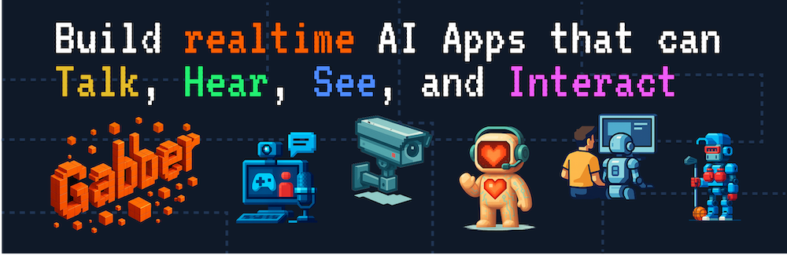

<p align="center">
  
</p>

# Gabber - 

[Gabber](https://gabber.dev) is an engine for building real-time AI across all modalities — voice, text, video, and more. It supports graph-based apps with multiple participants and simultaneous media streams. Our goal is to give developers the **most powerful, developer-friendly AI app builder** available.

If you found this interesting, please consider leaving a star ⭐️. We will be updating this repo frequently with new nodes and functionality.

## Quickstart 

### Install dependencies

__LiveKit__:
The frontend sends/receives media to/from the backend services via a local WebRTC session.
```bash
brew install livekit
```

__uv__:
For python dependency management.
```bash
curl -LsSf https://astral.sh/uv/install.sh | sh
```

### Run Everything
```bash
make all
```

## High-level Concepts

### App

An App is a graph consisting of nodes and their Pad connections. It's the highest level object in Gabber.

### Node

A Node is a functional building block within a Gabber app or subgraph. Each node performs a specific operation — like ingesting media, transcribing audio, analyzing emotions, calling an external API, or generating a response. Nodes can be composed into flows that define how your AI app behaves in real time.

Nodes have Inputs and Outputs called pads. Some pads have configurable properties that effect the behavior of the node.

### Pad

A Pad is a connection point on a node that allows it to send or receive data.

There are two types of pads:

- Sink Pads: Receive data from upstream nodes
- Source Pads: Send data to downstream nodes

And two "modes":

- Property: Always has a value, either an initial value or the last value streamed
- Stateless: Streams values as they happen

Pads are typed, so only compatible typed pads can be linked. When a node emits output on a pad, any downstream nodes connected to that pad can process the result in real time.

### SubGraph

A SubGraph is very similar to an App — it’s a collection of nodes and their pad connections. However, unlike an App, a SubGraph is designed to be embedded within other apps as a single node.

By using Proxy nodes, you can create entry and exit points from your subgraph that appear in your parent app. This makes it easy to pass data in and out of the SubGraph just like any other node.

### State Machine

A State Machine defines how your app moves between states using branching and conditional logic.

State Machines are made up of:
- **Parameters** — variables that the state machine listens to
- **States** — distinct phases in your application flow, starting from an initial state
- **State Transitions** — nodes that determine when to move from one state to another based on Parameters
- **Transition Logic** — transitions act as AND gates, and can be combined in parallel to create OR logic

## Anatomy

Gabber consists of a frontend and three backend services: engine, editor, repository.

### Frontend

The frontend is a NextJS app and is the user interface for interacting with the backend services. The frontend
can be accessed `http://localhost:3000`.

### Editor

The editor is a backend service. It's the server for the frontend.

### Engine

The engine is the service responsible for running apps.

### Repository

The repository service is a very thin local http server reponsible for fetching and saving apps and subgraphs.
All entities are stored in the `.gabber` directory. It runs on port `8001`.

## SDKs
Gabber provides SDKs to help you integrate these services into your applications quickly.

Currently available SDKs include:
- **JavaScript/TypeScript SDK** — framework-agnostic client library for Node.js, browsers, Bun, and Deno. Ideal for backend services or non-React frontends.
- **React SDK** — prebuilt hooks, providers, and UI components for building Gabber-powered apps in React or React Native with minimal setup.
- **Python SDK** — for backend integrations, prototyping, and scripting.

Refer to the SDK documentation in the main Gabber repo for installation and usage details.

## Example Apps
This repository includes example applications demonstrating how to use Gabber services together.
To explore them:
1. Run the repository locally (`make all` or run each service individually).
2. Navigate to the **Examples** tab in the dashboard.
3. Choose a sample app and follow the instructions.

These examples showcase real-world usage patterns for voice, text, and multimodal AI.

## Community
Gabber is source-available and developer-first — we’d love for you to build with us.

- **Questions or feedback?** Open a [GitHub Discussion](https://github.com/gabber-dev/gabber/discussions) or start a thread in [Issues](https://github.com/gabber-dev/gabber/issues).
- **See something missing?** We welcome contributions — new nodes or bugfixes are all appreciated.
- **Early access or enterprise?** [Reach out](mailto:brian@gabber.dev) or file an issue with the label `enterprise`.
- **Stay in the loop:** Follow [@gabberdev](https://x.com/gabberdev) on Twitter/X or star the repo to get updates.
- **Join the community** Join the [Discord](https://discord.gg/hJdjwBRc7g) to leave feedback, chat with the team & other builders, and stay up to date.

## License

The Gabber engine and frontend code are [fair-code](https://faircode.io) distributed under the [Sustainable Use License](https://github.com/gabber-dev/gabber/blob/master/LICENSE.md) and [Gabber Enterprise License](https://github.com/gabber-dev/gabber/blob/master/LICENSE_EE.md).

This code follows the same license as [n8n](https://github.com/n8n-io/n8n)

- **Source Available**: Always visible source code
- **Self-Hostable**: Deploy anywhere
- **Extensible**: Add your own nodes and functionality

Code that isn't core to the Gabber engine and editor, such as examples and SDKs, are licensed as Apache 2.0 which is denoted by a LICENSE file in the corresponding directories.
